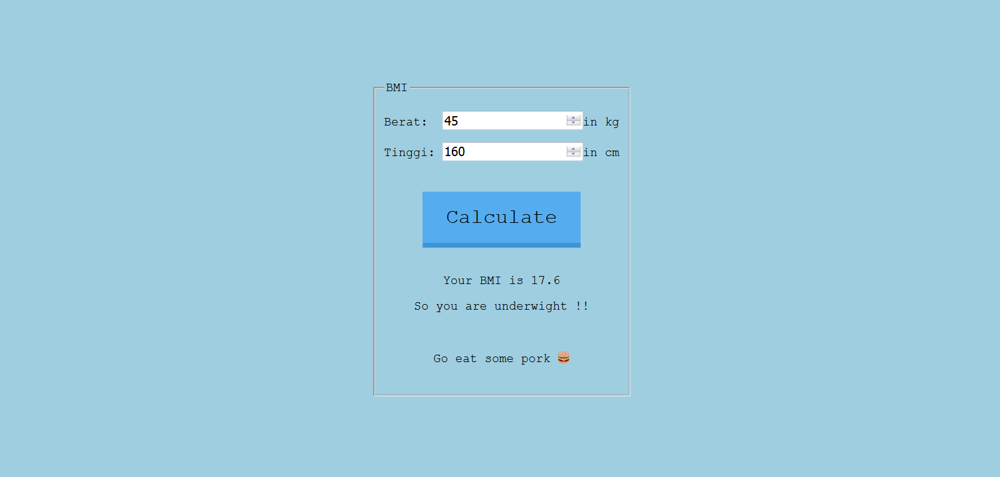

# BMI Calculator
> :information_source: Apa itu BMI?  
_Body Mass Index (BMI) atau Indeks Massa Tubuh (IMT) adalah angka yang menjadi
penilaian standar untuk menentukan apakah berat badan Anda tergolong normal, kurang, berlebih, atau obesitas._

## :round_pushpin:Table of contents
- _[About The Project](#about-the-project)_

## About The Project
**Repo ini dibuat untuk:**
- ...Belajar HTML dasar
- ...Belajar CSS dasar
- ...Belajar javascript dasar

**What the project does:**
- ...Menghitung apakah berat badan Anda ideal, kurang, atau berlebih

**Overview :rainbow:**

**Dibuat menggunakan:**
- ...Notepad++
- ...HTML
- ...CSS
- ...Vanilla Javascript

**To Do:**
- [ ] _Validation_

**Links:** 
- _...See it live! <a href="https://xvferdy.github.io/bmi-calculator/" target="_blank">Here</a>_
    
**Acknowledgements:**
- _...[Animated.css](https://daneden.github.io/animate.css/)_

